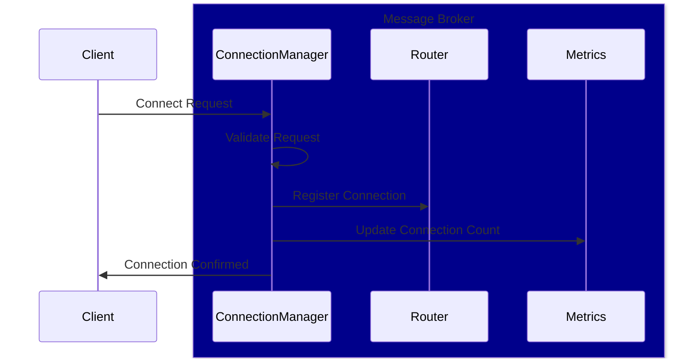
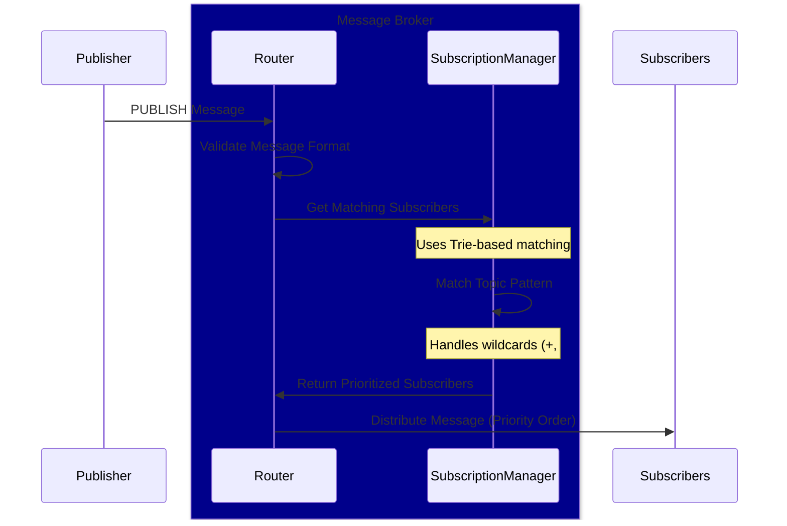
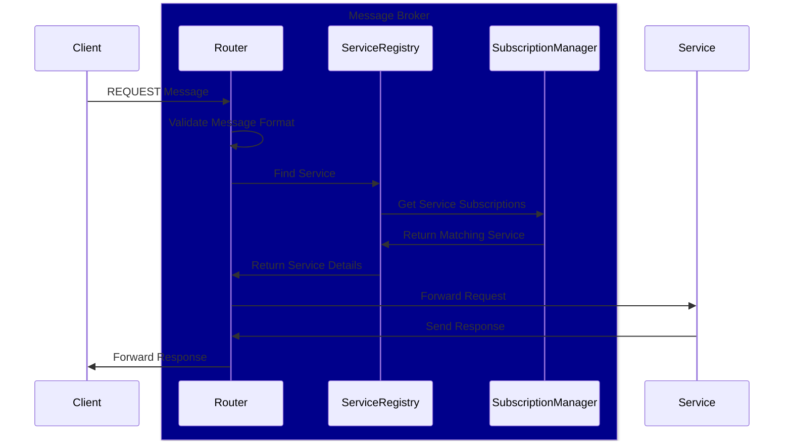
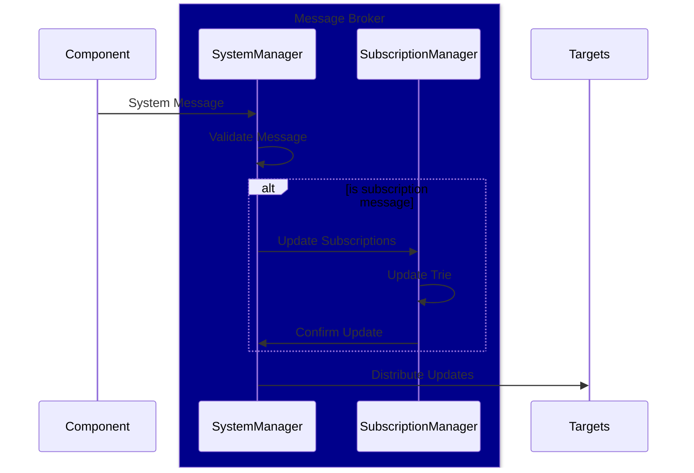

# Message Flow

This document explains how messages flow through the MB Server Node system.

## Core Message Flows

### 1. Connection Establishment

1. Client initiates connection (WebSocket/TCP)
2. Server validates connection request
3. Connection Manager creates new connection instance
4. Connection added to active connections pool
5. System message sent to confirm connection

### 2. Message Publishing

1. Client sends PUBLISH message
2. Server validates message format
3. Message Router processes message
4. Message distributed to subscribers
5. Metrics updated

### 3. Request-Response Flow

1. Client sends REQUEST message
2. Server validates request format
3. Request routed to appropriate service
4. Service processes request
5. Response sent back to client

### 4. System Messages

System messages are used for:
- Connection management
- Service registration
- Health checks
- Error notifications
- Subscription management

## Message Validation

All messages go through validation:
1. Format validation
   - Header format
   - Topic format
   - Action type
2. Size limits
   - Message size
   - Topic length
   - Payload size
3. Topic pattern validation
   - Segment format
   - Wildcard placement
   - Maximum depth
4. Rate limiting checks
   - Global limits
   - Service limits
   - Connection limits

## Error Handling

Errors are handled at multiple levels:
1. Connection level
2. Message level
3. Service level
4. System level

Error responses include:
- Error code
- Error message
- Original request ID
- Additional context

## Flow Control

### Rate Limiting
- Global rate limits
- Per-connection limits
- Per-service limits

### Request Management
- Request timeouts
- Maximum concurrent requests
- Request queueing

## Performance Considerations

1. Message Queuing
   - High throughput handling
   - Back pressure management
   - Queue size limits

2. Connection Management
   - Connection pooling
   - Load balancing
   - Resource limits

3. Message Distribution
   - Efficient subscriber lookup
   - Parallel message distribution
   - Batch processing

## Best Practices

1. Message Design
   - Keep payloads small
   - Use appropriate timeouts
   - Implement retry logic

2. Topic Design
   - Use hierarchical topics
   - Avoid wildcard overuse
   - Group related messages

3. Error Handling
   - Implement proper error handling
   - Use appropriate error codes
   - Log errors appropriately

4. Performance Monitoring
   - Monitor message rates
   - Track error rates
   - Watch resource usage